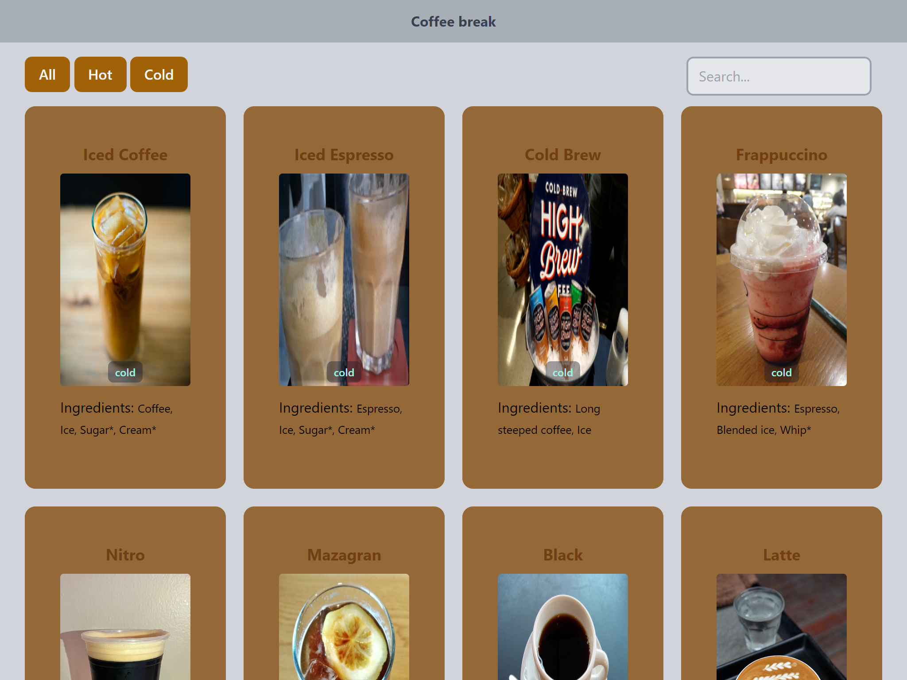

# Coffee Challenge 

## Introduction   
### Hello, thank you for taking a look on this project, it is a challenge with the idea of reading the coffee API data with cold and hot coffees and displaying the basic info on cards that can be clicked to get full information. It is possible to filter the coffees by cold and hot and search thjem by title on the inputfield on the top of the screen This is a updated version with more features and you can access it by the [link](https://cleber-severo.github.io/Coffe-api-challenge/)

### The project has been made with HTML, CSS, JavaScript and Tailwind, having the best practices looking for perfomrmace, good styling and responsive design.

## Searching for an especific coffee

### Mobile screen
]

## Modal on mobile in landscape
]

## Techs implemented:
 

  
  
  
 
 

 

### Developer: Cléber Severo 
 
 

 